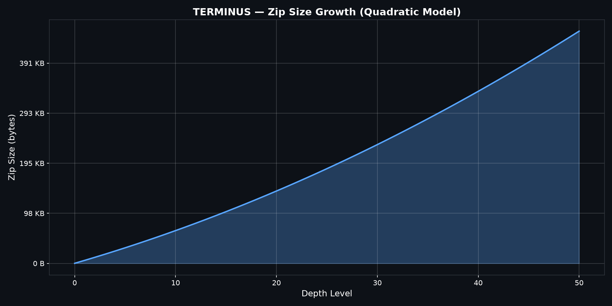
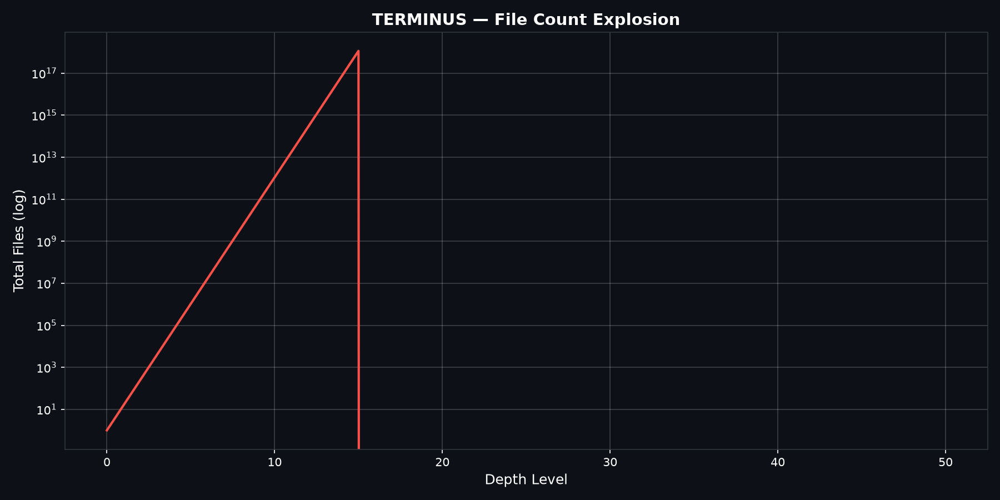
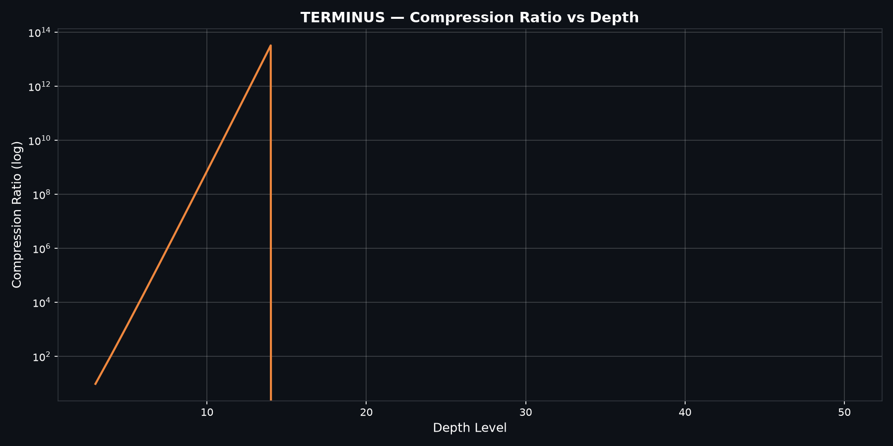
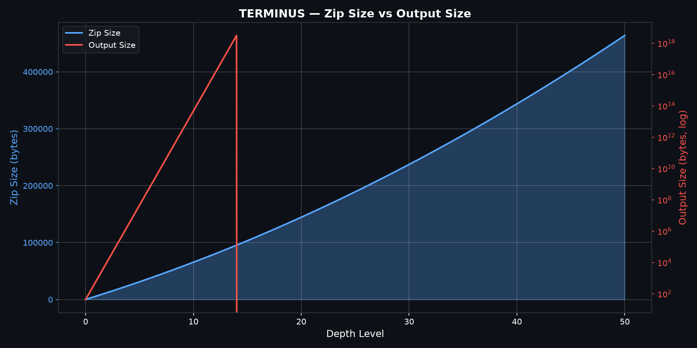
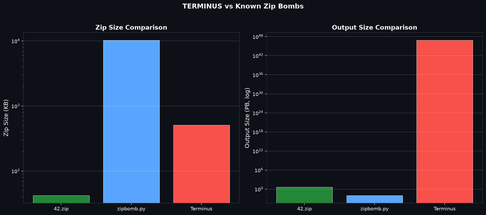
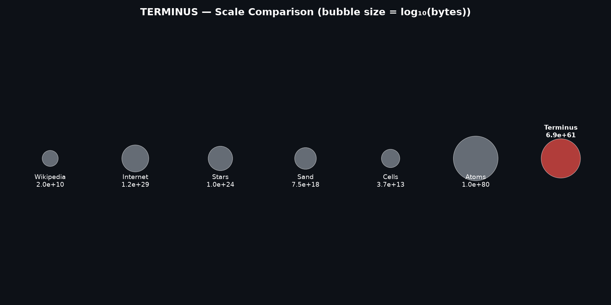
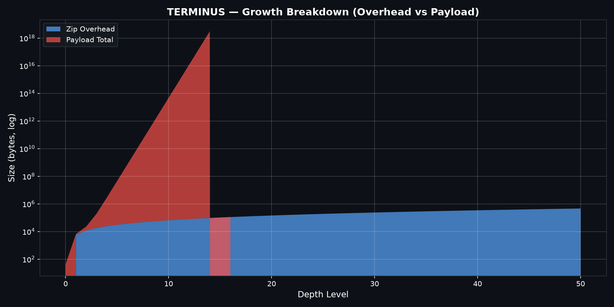

# TERMINUS - DONT EXTRACT!

```
████████╗███████╗██████╗ ███╗   ███╗██╗███╗   ██╗██╗   ██╗███████╗
╚══██╔══╝██╔════╝██╔══██╗████╗ ████║██║████╗  ██║██║   ██║██╔════╝
   ██║   █████╗  ██████╔╝██╔████╔██║██║██╔██╗ ██║██║   ██║███████╗
   ██║   ██╔══╝  ██╔══██╗██║╚██╔╝██║██║██║╚██╗██║██║   ██║╚════██║
   ██║   ███████╗██║  ██║██║ ╚═╝ ██║██║██║ ╚████║╚██████╔╝███████║
   ╚═╝   ╚══════╝╚═╝  ╚═╝╚═╝     ╚═╝╚═╝╚═╝  ╚═══╝ ╚═════╝ ╚══════╝
```

**RECURSIVE ZIP BOMB**

497 KB compressed -> 6.91 x 10^61 bytes output

---

## what is this

a recursive zip bomb. ~497 KB compressed, produces a theoretical output of 6.91 x 10^61 bytes.

built on the 42.zip algorithm. level 50, branching factor 16, 43-byte payload.

---

## DO NOT EXTRACT

```
+-----------------------------------------------------------------------+
|                                                                       |
|   Terminus.zip creates 1.6 x 10^61 files                             |
|   Requires 6.91 x 10^61 bytes of disk space                          |
|   Attempting extraction can exhaust available storage and resources   |
|   and may make the system unusable.                                   |
|                                                                       |
|   This is a research artifact. Don't be stupid with it.               |
|                                                                       |
+-----------------------------------------------------------------------+
```

---

## specs

```
+------------------+----------------------------------------------------+
| FILE             | Terminus.zip                                       |
| SIZE             | 497 KB (508,950 bytes)                             |
| SHA256           | 5269c1b60f9497eb8a6bf9734e819f2a2e2aa2d2b8166fe49 |
|                  | f116d852b5522de                                     |
| FILES INSIDE     | 16 (bomb_0000.zip - bomb_0015.zip)                |
| EACH INNER       | ~30.75 KiB (all identical)                         |
| TOTAL FILES      | 1,606,938,044,258,990,275,541,962,092,341,      |
|                  | 162,602,522,202,993,782,792,835,301,376           |
| DIGITS           | 61                                                 |
| OUTPUT SIZE      | 6.91 x 10^61 bytes                                |
| RATIO            | 1 : 1.36 x 10^56                                  |
| BUILD TIME       | 0.36 seconds                                       |
+------------------+----------------------------------------------------+
```

---

## comparisons

```
+-------------------------------+----------------+------------------+
| Reference                     | Size           | vs Terminus      |
+-------------------------------+----------------+------------------+
| Wikipedia English             | ~20 GB         | 3.22 x 10^51 x  |
| Entire Internet               | ~120 ZB        | 4.88 x 10^38 x  |
| Stars in Observable Universe  | ~10^24         | 6.22 x 10^36 x  |
| Grains of Sand on Earth       | ~7.5 x 10^18   | 2.14 x 10^42 x  |
| Cells in Human Body           | ~3.7 x 10^13   | 4.34 x 10^47 x  |
| Atoms in Observable Universe  | ~10^80         | 6.22 x 10^-20 x |
+-------------------------------+----------------+------------------+
```

atoms in the universe still win. but barely.

---

## how it works

```
  LEVEL 0                LEVEL 1                LEVEL 2
+----------+        +--------------+      +----------------------+
| data.bin |        | bomb_0000.zip|      | bomb_0000.zip        |
| (43 B)   |  =>    | bomb_0001.zip|  =>  |  +-- bomb_0000.zip   |
+----------+        | ...          |      |  +-- bomb_0001.zip   |
   120 B zip        | bomb_0015.zip|      |  +-- ...             |
                    | (16 copies)  |      | bomb_0001.zip        |
                    +--------------+      |  +-- bomb_0000.zip   |
                       2.72 KB zip        |  +-- ...             |
                                          +----------------------+
                                             6.43 KB zip

                    ... repeat 50 times ...

  OUTPUT: 16^50 files = 1.6 x 10^60 files = 6.91 x 10^61 bytes
```

the trick: zip size grows ~8KB per level (linear). output multiplies by 16 per level (exponential).

---

## visuals

### charts















### video


---

## quick start

### simulation

```bash
# interactive mode
python3 terminus_sim.py

# cli mode
python3 terminus_sim.py 16 50 43

# with payload type
python3 terminus_sim.py 16 50 43 text

# animation
python3 terminus_anim.py

# create config file
python3 terminus_sim.py --config

# run with config
python3 terminus_sim.py --config terminus_config.json

# compare with known bombs
python3 terminus_sim.py --compare

# find optimal config
python3 terminus_config.py

# build ultra version (256^100)
python3 terminus_ultra.py ultra

# list all versions
python3 terminus_ultra.py --list
```

### graphics

```bash
# generate charts (requires: pip install matplotlib numpy)
python3 terminus_graph.py

# output: terminus_charts/ directory with 7 PNG charts
```

### video

```bash
# generate video (requires: pip install matplotlib numpy imageio[ffmpeg])
python3 terminus_video.py

# output: terminus_explosion.mp4 (10s, 30fps, 1080p)
```

### interactive charts (plotly)

```bash
# generate interactive HTML charts
python3 src/web/plotly_charts.py

# output: terminus_interactive/terminus_interactive.html
```

### terminal UI (rich)

```bash
# run rich terminal UI
python3 src/cli/rich_ui.py
```

### JavaScript

```bash
# run demo
node examples/demo.js

# run tests
node tests/test.js
```

### Docker

```bash
# build image
docker build -t terminus .

# run container
docker run -p 5000:5000 terminus
```

no files created. just math.

### verify

```bash
# check size
ls -lh Terminus.zip

# verify hash
shasum -a 256 Terminus.zip
# expected: 5269c1b60f9497eb8a6bf9734e819f2a2e2aa2d2b8166fe49f116d852b5522de

# list contents (safe - don't extract)
zipinfo Terminus.zip
```

### run tests

```bash
# install pytest
pip install pytest

# run python tests
pytest tests/ -v

# run javascript tests
node tests/test.js
```

---

## rebuild

```python
import zipfile, io

def create_level(depth, branching=16, payload=43):
    if depth == 0:
        buf = io.BytesIO()
        with zipfile.ZipFile(buf, 'w', zipfile.ZIP_DEFLATED) as zf:
            zf.writestr("data.bin", b'\x00' * payload)
        return buf.getvalue()
    inner = create_level(depth - 1, branching, payload)
    buf = io.BytesIO()
    with zipfile.ZipFile(buf, 'w', zipfile.ZIP_DEFLATED) as zf:
        for i in range(branching):
            zf.writestr(f"bomb_{i:04d}.zip", inner)
    return buf.getvalue()

with open("Terminus.zip", "wb") as f:
    f.write(create_level(50))
```

---

## deployment

### GitHub Pages (automatic)

already configured. every push to main deploys automatically.

site: https://kagan-u.github.io/Terminus

### Manual

```bash
# deploy site/ folder to any static host
```

---

## project structure

```
Terminus/
├── Terminus.zip                 the bomb
├── terminus_sim.py              safe simulator (v2)
├── terminus_anim.py             terminal animation
├── terminus_graph.py            matplotlib charts
├── terminus_video.py            video generator
├── terminus_ultra.py            ultra version builder
├── terminus_config.py           version config & optimizer
├── terminus_explosion.mp4       generated video (10s, 1080p)
├── terminus_charts/             generated charts (7 PNGs)
├── README.md                    this file
├── SECURITY.md                  safe usage guidelines
├── requirements.txt             python dependencies
├── pyproject.toml               pypi config
├── package.json                 npm config
├── Dockerfile                   docker setup
├── js/
│   └── terminus.js              javascript port
├── src/
│   ├── core/
│   │   ├── __init__.py          core simulation engine
│   │   └── optimizer.py         config optimizer
│   ├── cli/
│   │   ├── main.py              cli entry point
│   │   └── rich_ui.py           rich terminal ui
│   ├── api/
│   │   └── __init__.py
│   └── web/
│       └── plotly_charts.py     plotly interactive charts
├── site/
│   ├── index.html               static site (GitHub Pages)
│   ├── css/style.css            site styles
│   └── js/
│       ├── terminus.js          javascript port
│       └── app.js               site logic
├── tests/
│   ├── test_simulation.py       pytest tests
│   └── test.js                  javascript tests
├── examples/
│   └── demo.js                  javascript demo
├── docs/
│   ├── ARCHITECTURE.md          how the recursion works
│   ├── BENCHMARKS.md            performance data
│   ├── TECHNICAL.md             algorithm deep dive
│   ├── EXTRACTION.md            step-by-step extraction guide
│   ├── COMPARISON.md            vs other zip bombs
│   └── CHANGELOG.md             version history
└── .github/
    └── workflows/
        └── ci.yml               github actions
```

---

## docs

| document | description |
|----------|-------------|
| [ARCHITECTURE.md](docs/ARCHITECTURE.md) | how the recursion works |
| [TECHNICAL.md](docs/TECHNICAL.md) | algorithm deep dive |
| [EXTRACTION.md](docs/EXTRACTION.md) | step-by-step extraction guide |
| [COMPARISON.md](docs/COMPARISON.md) | vs other zip bombs |
| [BENCHMARKS.md](docs/BENCHMARKS.md) | performance data |
| [CHANGELOG.md](docs/CHANGELOG.md) | version history |
| [SECURITY.md](SECURITY.md) | safe usage guidelines |

---

## install

### python

```bash
pip install -e .
```

### npm

```bash
npm install
```

---

## license

CC0 1.0 Universal
